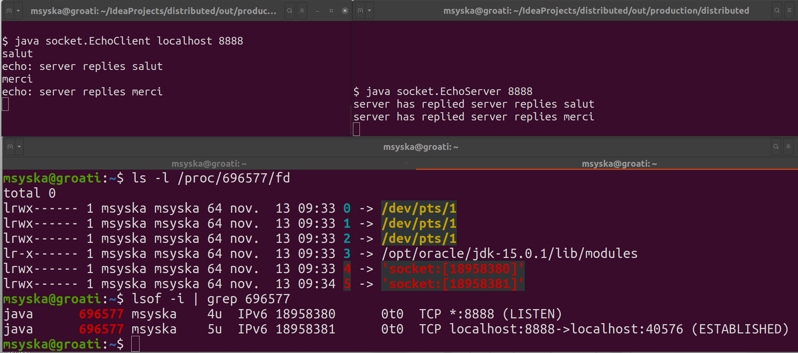

# TP 4 SOCKETS JAVA : COMMUNICATION AVEC DES « STREAMS » OU DES « DATAGRAMS »

Dans ce TP on va étudier la mise en œuvre des sockets TCP et UDP en Java à partir des exemples du tutoriel Oracle et
en observant leur implémentation sous Linux (utilisez votre VM sous VirtualBox si vous n'êtes pas déjà sous Linux). 
Si vous travaillez sous macOS vous êtes libre d'adapter le TP, mais je ne pourrez pas forcèment vous aider.

## Rendu de TP 4

À la fin de ce TP vous devez déposer un compte rendu par exercice de nom `tp_4_exercice_num.md` ou `tp_4_exercice_num.pdf` 
avec les réponses de l’exercice numéro num sur votre classroom github MIAGE

## Connexions IP vues depuis le système Linux ou Windows
Les outils suivants sont utiles pour vérifier la configuration des interfaces et les connexions en
cours.
* `ifconfig` ou de préfèrence `ip address` (`ipconfig` sous Windows)
* `netstat`
* `lsof -i` sous Linux ou `netstat -ban` sous Windows (avec une élévation de privilège)
* `host myhost` pour connaître l’adresse IP de votre PC Linux.
Les numéros de port inférieurs à 1024 sont reservés par le système : ne pas les utiliser. Voir
https://www.iana.org/assignments/service-names-port-numbers/service-names-port-numbers.xhtml

## Exercice 1 : Socket Stream
Rappel : cet exercice doit être réalisé sous Unix.

À partir des exemples du tutoriel Oracle, vous devez créer un document (avec LibreOffice ou
au format Markdown) incluant les commentaires et les copies écran - au format png - avec autant
de terminaux que nécessaire qui illustrent les démos de :

1. `EchoClient` / `EchoServer`
2. `KnockKnockClient` / `KnockKnockServer`
3. `KnockKnockClient` / `KnockKnockMultiServer`

Si vous utilisez LibreOffice (ou équivalent), vous devez rendre la version pdf du document
et non la source.

* Vous devez proposer des hosts différents (en collaboration avec vos voisins si vous êtes confinés en coloc, sinon dans tous les cas avec des terminaux différents) pour chaque client / serveur mis en œuvre et lancer les programmes en ligne de commande depuis un terminal et non un IDE.
* Après chaque lancement de programme (un à un) vous devez exécuter la commande `lsof` et
comparer le résultat avec celui de la commande `ls -l /proc/$PID/fd`. Par exemple,
dans la cas du premier programme lancé (`EchoServer`), si le numéro de port choisi est
39000 et le pid du processus Java correspondant est 27345, alors on examinera les résultats de :
```bash
$ lsof -i :39000
$ ls -l /proc/27345/fd
```
* Les clients auraient pu se connecter à des serveurs différents de localhost dans la salle de
TP. Par exemple depuis une connexion ssh ou après avoir demandé à un collègue connecté à ce poste de
lancer le serveur sur ce host.

Vous devez commenter les informations produites par ces deux commandes au fur et à mesure des exécutions,
en vous aidant de leur documentation.



D’autres informations sont disponibles avec l’option `p` de `lsof`. Pour l’exemple précédent,
essayez `lsof -p 27345`.

Le lien vers le tutoriel est :
http://docs.oracle.com/javase/tutorial/networking/index.html

Attention ! Ne pas faire de copier/coller des sources depuis les pages Web mais enregistrez les depuis le
lien Download de chaque exemple.


## Exercice 2 : Socket Datagram
Rappel : cet exercice doit être réalisé sous Unix.

À partir des exemples du tutoriel Oracle, vous devez créer un document (avec LibreOffice ou
au format Markdown) incluant les commentaires et les copies écran - au format png - avec autant
de terminaux que nécessaire qui illustrent les démos de :

1. `QuoteClient` / `QuoteServer`
2. `MulticastClient` / `MulticastServer` (optionnel)

* si vous utilisez LibreOffice (ou équivalent), vous devez rendre la version pdf du document
et non la source.

* vous devez proposer des hosts différents (en collaboration avec vos voisins si c'est possible) pour chaque
client / serveur mis en œuvre et lancer les programmes en ligne de commande depuis un
terminal et non un IDE.

* après chaque lancement de programme (un à un) vous devez exécuter la commande `lsof` et
comparer le résultat avec celui de la commande `ls -l /proc/$PID/fd`. 

Par exemple, dans la cas du premier programme lancé (`QuoteServer`), le numéro de port choisi est
5433, si le pid du processus Java correspondant est 27345, alors on examinera les résultats
de :
```bash
$ lsof -i UDP
$ ls -l /proc/27345/fd
```
Vous devez commenter les informations produites par ces deux commandes au fur et à mesure des exécutions,
en vous aidant de leur documentation.
Dans un deuxième temps, vous devez ajouter une pause dans le client pour pouvoir observer
ses connexions (par exemple avec `Threads.sleep(30000)`).

Le lien vers le tutoriel est :
http://docs.oracle.com/javase/tutorial/networking/index.html
